# Vintage film posters

## From author

It's me, [Matthias](https://stagyrite.github.io/ "Maciej Matiaszowski | Stagyrite") (yes, that programmer).
I create Jekyll content from vintage film posters to give them a new life with Internet exposure.
As a result of this refreshment, I uploaded a few colourised posters that were previously monochrome.
I also have [a refreshed Perl 1 compiler](https://github.com/Stagyrite/Perl-1.0 "Stagyrite/Perl-1.0: 🐪 Perl Kit, Version 1.0"),
as well as [a channel with C64 games](https://eltikia.github.io/ "Nostalgie-Ecke von Stagirit").

## Gallery

[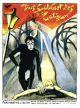](images/big/caligari.png "🇩🇪 Das Cabinet des Dr. Caligari &#124; The Cabinet of Dr. Caligari (1920)")
[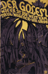](images/big/der-golem.png "🇩🇪 Der Golem, wie er in die Welt kam &#124; The Golem: How He Came into the World (1920)")
")
")
[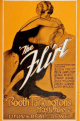](images/big/the-flirt.png "🇺🇸 The Flirt (1922)")
")
")
[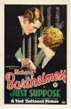](images/big/just-suppose.png "🇺🇸 Just Suppose (1926)")
")
")
")
")
")
")
")
")
")
[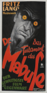](images/big/das-testament-des-dr-mabuse.png "🇩🇪 Das Testament des Dr. Mabuse &#124; The Testament of Dr. Mabuse (1933)")
")
")
")
")
[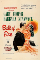](images/big/ball-of-fire.png "🇺🇸 Ball of Fire (1941)")
")
[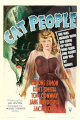](images/big/cat-people.png "🇺🇸 Cat People (1942)")
")

## Monochrome gallery

")
[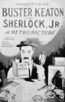](images/big/sherlock-jr.jpg "🇺🇸 Sherlock, Jr.")
[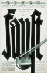](images/big/faust.png "🇩🇪 Faust - Eine deutsche Volkssage &#124; Faust – A German Folktale (1926)")
")
")
")
")
")
")

## Gallery colorization

[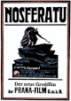](images/colorized/big/nosferatu.jpg "🇩🇪 Nosferatu – Eine Symphonie des Grauens &#124; Nosferatu: A Symphony of Horror (1922)")

[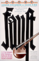](images/colorized/big/faust.jpg "🇩🇪 Faust - Eine deutsche Volkssage &#124; Faust – A German Folktale (1926)")
[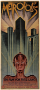](images/colorized/big/metropolis.jpg "🇩🇪 Metropolis (1926)")
[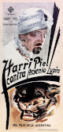](images/colorized/big/panik.jpg "🇩🇪 Panik &#124; Panic (1928)")
")
")
")
")

---

⚓⛵🚨🏘️
