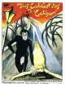
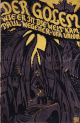
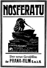
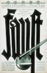

<!---
	Copyright © 2024 Maciej Matiaszowski <maciej.matiaszowski@gmail.com>

	Verbatim copying and redistribution of this entire page are permitted
	provided this notice is preserved.
-->

# Vintage film posters

## From author

It's me, [Matthias](https://stagyrite.github.io/ "Maciej Matiaszowski | Stagyrite") (yes, that programmer).
I create Jekyll content from vintage film posters in order to give them a new life with Internet exposure. I also have
[a refreshed Perl 1 compiler](https://github.com/Stagyrite/Perl-1.0 "Stagyrite/Perl-1.0: 🐪 Perl Kit, Version 1.0"),
as well as [a channel with C64 games](https://eltikia.github.io/ "C64 &#124; \(^_^)/ &#124; eltikia").

## Gallery

")
")
")
")
")
")
")
")
")
")
")
")
")
")
")
")
")
")
")
")
")

 

⬛⚛🍅👺
